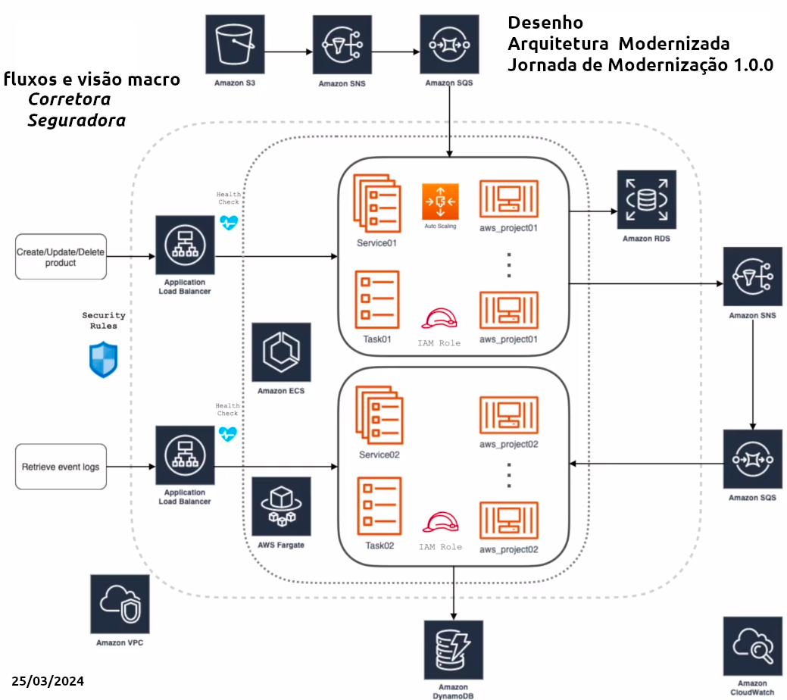
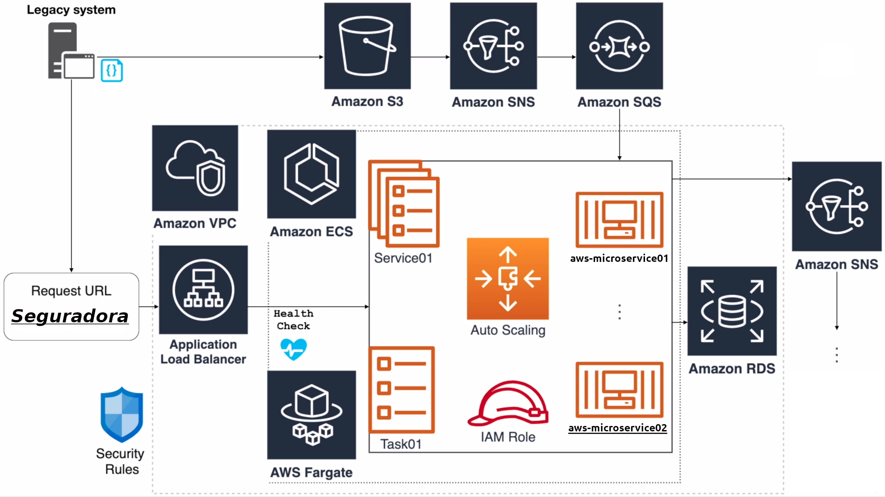

<h1 align="center">
    CHALLENGE - SR. SOFTWARE ENGINEER
    Jefferson Junior 
</h1>

## Índice
1. [**Projeto Challenge**](#1-Jornada-de-Modernização-com-AWS-e-microserviços-em-Java)
2. [**Partes do Projeto**](#2-Partes-do-Projeto)
3. [**Proposta de Modernização**](#3-Proposta-de-Modernização)
4. [**Respostas aos Questionamentos**](#4-Respostas-aos-Questionamentos)
5. [**Observações Importantes**](#5-Observações-Importantes)
6. [**Visão Macro dos Servivos e Microservicos**](#6-Visão-Macro-dos-Servivos-e-Microservicos)
7. [**Modelo de Dados e Tabelas**](#7-Modelo-de-Dados-e-Tabelas)
8. [**Execução da Criação de Serviços na Conta da AWS**](#8-Execução-da-Criação-de-Serviços-na-Conta-da-AWS)
9. [**Código Fonte e Repositórios**](#9-Código-Fonte-e-Repositórios)
10. [**SOBRE O NatGateway**](#10-SOBRE-O-NatGateway)
11. [**Lambda Function**](#11-Lambda-Function)
12. [**Experiência**](#12-Experiência)

---

## 1. Projeto Challenge

Foi pensado preliminarmente em desenvolver uma aplicação completa dos fluxos de cotação, seguro de veículo, apólices entre outros, portanto, foram necessários estudar alguns formulários com dados de clientes, propostas de cotação, apólice de seguros, dados de seguradora e corretora e suas diferença operacionais.

O projeto consiste em um módulo para subir toda a infraestrutura na Cloud AWS e dois microserviços que apoiam o fluxo do sistema legado da corretora e seguradora. Existe ainda um projeto base que foi concebido no início para abranger mais dados sobre o domínio da aplicação qeue foi depreciado ao longo do desenvolvimento.

O projeto foi desenhado com um modelo macro e depois detalhado para avaliar quais ferramentas, recursos e serviços seriam desenvolvidos. Foi projetado um digrama modernizado da aplicação e propostos alguns elementos que iriam transformar o fluxo legado para algo mais gerenciável, robusto, eficiente e moderno através da Cloud AWS.

- Qualidade de legibilidade de código

Foi pensando em desenvolver dois projetos (project01 e project02) que fossem representados pelos atores no negócio mas ao mesmo tempo como domínio de aplicação com os serviços necessários então estes projetos são os aws_microservice01 e aws_microservice02 que representam a corretora e seguradora respectivamente. A estrutura de código foi granulada em pacotes e suas configurações foram mínimas na IDE.

- Cobertura de testes

Embora as premissas não terem abordado a quantidade mínima de cobetura de código as aplicações tiverama uma quantidade talvez abaixo dos 50% e sendo aplicado mais na versão maior que antes foi criada pensando em todos os serviços juntos antes de se pensar na ideia de fragmentar.

- Cplicabilidade de padrões de projetos

Alguns padrões ficaram mais implicitos pelo uso do SpringBoot até pela quantidade de classes do projeto simplificado mas na rotina de persitência do Dynamo e MySQL alguns padrões aumentariam a consistência e diminuiriam o acoplamento como Factory Method, Abastract Factory, Singleton, Facade e Adapter. 

- Arquitetura dos apps

Foi desenvolvida principalmente a arquitetura e microserviços para os apps.

- Desenho de arquitetura da solução modernizada

Foi disponibilizado o novo desenho da arquitetura modernizada da aplicação anexa ao projeto.


**Termos utilizados no projeto**:

1. Product (Cotacao/Seguro/Venda/Apolice)
2. Invoice (fatura)
3. InvoiceSale (FaturaVenda)
4. Sale (Venda)
5. EventLog (Eventos de Log)
6. Queue (Fila - Standart/DLQ)

**Conceitos Importantes**:

1. **ECS** - Elastic Container Service é um serviço de orquestração gerenciado. AWS usa recursos prórpios para tornar esta orquestração dispinível, integrada e verificada;

2. **AWS Fargate** é um recurso que elimina a necessidade de provisionar e gerenciar servidores e aumenta a segurança com apps isolados. Como por exemplo o gerenciamento de recursos com instâncias EC2, configuração de VPC;

3. **EC2** - Elastic Compute Cloud é uma instância de servidor virtual que permite executar aplicativos na infra AWS;
   - Instância com computação acelerada/instâncias de GPU para computaçao de uso geral
   - Instâncias de GPU gráficas para gráficos 
   - Instâncias Computacionais em hardware programável FPGA para workloads científicos avançados
4. **VPC** - Nuvem Virtual Privada é uma rede virtual dedicada à conta AWS. Está isolada logicamente de outras redes virtuais, possui um intervalo de IP para a VPC, podendo ter Sub-Rede, adcionar Gateways, associar grupos de segurança. Uma Sub-Rede é um intervalo de endereços IP na VPC;

5. **Cluster** é um conjunto de máquinas logicamente agrupadas onde os containeres irão rodar;

6. **Task Definition** é a especificação de quantos e quais containeres, recursos computacionais, volumes e outros;

7. **Task** é a operação que será realizada pelo container que foi levantado configurada através de Task Definition;

8. **Service** é o agrupdor de tarefas que define quantos e quais tarefas serão executadas simultaneamente;
   - Se alguma tarefa falhar o Scheduler levanta uma nova e configura novos serviços de rede, loadbalancer;
   
9. **Load Balancer** é um balanceador de carga que distribui o tráfego para vários destinos como instâncias EC2 e diversas zonas de disponibilidade que gera maior disponibilidade de app;
10. Escala Horizontal é a adição de mais nodes, máquinas que irão ampliar os recursos;
11. Escala Vertical é a adição de mais recurso de hardware como memória, processador, CPU;


## 2. Partes do Projeto

**O desafio foi composto de três partes distintas**

1. *Criação, configuração e administração da infraestrutura AWS*
   - Criação da Imagem Docker (localstack, vpc, container, Rds, Sns, Sqs, DynamoBD, S3)
   - Criação da Versão/Tag Docker Hub (aws_microservice01, aws_microservice02)
   - Deploy Services (Service01, Service02)
   - Deploy version Apps 
   - AWS CDK 2.133.0 (corretora_cdk)
   - Java 17
   - MySQL 5.7 / *8 (teste da versão mais atual) 

2. *Implementação dos microserviços e projetos de infra*
   - criação da imagem docker (corretora e seguradora)
   - criação da infra AWS (corretora_cdk e *seguradora_cdk)
   - criação do aws_microservico01
   - criação do aws_microservico02
   * decidiu-se centralizar toda a criação das stacks em corretora_cdk para ambos os projetos de infra na Cloud AWS.

3. *Escrita de documentação técnica*
   - Desenho Arquitetura Modernizada
   - Diagrams E-R/Class
   - Evidências de Teste
   - Evidências de criação do ambiente e execução com telas
   - Conceitos dos principais serviços AWS

* As imagens se encontram na pasta images [https://github.com/jeffjras/portfolio/tree/challenge/images]
* O código fonte está em repositórios do Github
* Os artefatos como banco de dados, collections insomnia e outros se encontram na pasta files [https://github.com/jeffjras/portfolio/tree/challenge/files]

## 3. Proposta de Modernização




1. Exclusão do uso de FTP
2. Ao rodar cron/job via lambda poderá feita de duas maneiras (abordagens)
   - criar a função lambda em python (otimizada para gravar os dados no RDS/MySQL) para consumir os dados da fila SQS
   - criar a função programada usando uma expressão CRON = a cada 1h de todos os dias da semana, gravar no S3 e após gravar no banco de dados

**Uso de LambdaFunction**

Associação da fila SQS com a LambdaFunction (*Mapeamento da Origem do Evento*)
FILA SQS: *ProductEvents* (LambdaRDSQueue)

**LAMBDA FUNCTION**

Name: LambdaFunctionWithRDS 

 - Adicionar Gatilho > Escolher Amazon SQS para origem > Escolher o nome da fila > Tamanho do Lote 1

Teste na Fila Amazon SQS (ProductEvents)
JSON para enviar e receber mensagens
Enviar Mensagem Body:
```
{
    "ProdID": 1054,
    "Name": "SeguroX"
}
```
Exemplo de Lambda -  Runtime com Python - Insert Data RDS
 - Add Trigger → Procurar por S3 → Selecionar
    Bucket → Procurar o bucket que foi criado → Selecionar.
Event type → Escolher PUT.
-----------------------------
```
import sys
import logging
import pymysql
import json
import os

# Rds Settings
user_name = os.environ['USER_NAME']
password = os.environ['PASSWORD']
rds_proxy_host = os.environ['RDS_PROXY_HOST']
db_name = os.environ['DB_NAME']

logger = logging.getLogger()
logger.setLevel(logging.INFO)

```

- **Create the database connection outside of the handler to allow connections to be**
**re-used by subsequent function invocations**

```
try:
	    conn = pymysql.connect(host=rds_proxy_host, user=user_name, passwd=password, db=db_name, connect_timeout=5)
except pymysql.MySQLError as e:
    logger.error("ERROR: Unexpected error: Could not connect to MySQL instance.")
    logger.error(e)
    sys.exit(1)

logger.info("SUCCESS: Connection to RDS for MySQL instance succeeded")

def lambda_handler(event, context):
    """
    This function creates a new RDS database table and writes records to it
    """
    message = event['Records'][0]['body']
    data = json.loads(message)
    CustID = data['CustID']
    Name = data['Name']

    item_count = 0
    sql_string = f"insert into Product (ProductID, Name) values({ProdID}, '{Name}')"

    with conn.cursor() as cur:
        cur.execute("create table if not exists Product ( ProductID  int NOT NULL, Name varchar(255) NOT NULL, PRIMARY KEY (ProductID))")
        cur.execute(sql_string)
        conn.commit()
        cur.execute("select * from Product")
        logger.info("The following items have been added to the database:")
        for row in cur:
            item_count += 1
            logger.info(row)
    conn.commit()

    return "Added %d items to RDS for MySQL table" %(item_count)
```    
JSON do Evento
```
{
  "Records": [
    {
      "messageId": "059f36b4-87a3-44ab-83d2-661975830a7d",
      "receiptHandle": "AQEBwJnKyrHigUMZj6rYigCgxlaS3SLy0a...",
      "body": "{\n     \"ProdID\": 6,\n     \"Name\": \"Product SeguroX\"\n}",
      "attributes": {
        "ApproximateReceiveCount": "1",
        "SentTimestamp": "1545082649183",
        "SenderId": "AIDAIENQZJOLO23YVJ4VO",
        "ApproximateFirstReceiveTimestamp": "1545082649185"
      },
      "messageAttributes": {},
      "md5OfBody": "e4e68fb7bd0e697a0ae8f1bb342846b3",
      "eventSource": "aws:sqs",
      "eventSourceARN": "arn:aws:sqs:us-west-2:123456789012:ProducEvents",
      "awsRegion": "us-west-1"
    }
  ]
}
```

## 4. Respostas aos Questionamentos

# Premissas
- não será permitida troca de arquivos; 
  R - troca de arquivo feita pela aplicação no ambiente de nuvem
- só serão permitidas comunicações remotas através de protolocos seguros e criptogrados;
  R - configurado a comiunicação através de serviços gerenciados na Cloud AWS;
- a solução deve possuir resiliência, alta disponibilidade e tolerância à falhas;
  R - fora utilizados os serviços da nuvem AWS que agregam estes recursos;
- deverá existir uma convivência entre o modernizado e o legado (o legado da Seguradora não pode ser modernizado devido ao seu tamanho - e tempo é dinheiro)
  R - a Seguradora pode continuar trabalhando no sistema legado;
- todo o ecossitema da corretora deverá ser modernizado (cotação e contratação, por exemplo)
  R-  a parte da corretora está totalmente modernizada e aderente à nova proposta
- parte do ecossistema de seguradora deverá ser modernizado, para que a comunicação com a corretora ocorra de maneira eficaz (invocações de chamadas HTTP, por exemplo)
  R- aplicação foi feita expondo os endpoints necessários e comunitação HTTP disponível;

# O que é esperado
Você deve modelar e implementar uma solução em núvem pública seguindo princípios de uma arquitetura moderna:
- 12 factors - Realizada de forma escalável e de manutenção simples com pacotes configs
- arquitetura distribuída - Realizada através dos recursos Cloud
- comunicação assíncrona - Realizada através dos serviços Cloud
- serverless - Sim, Código fonte anexo para implantação da versão do LambdaFunction
- orientada e segregada por domínio Sim, focada no domínio da aplicação
- finops - projeto foi pensando em utilizar menor custo e consumo possível 
- monitoramento e observabilidade - Sim, através do serviço CloudWatch
- qualidade de código - Sim, através de abordagens simples mas funcionais com reuso e manutenibilidade 
- estilos arquiteturais - Sim, os padrões já conhecidos MVC, Microserviços, Eventos e por dentro da aplicação alguns como singleton, chain of responsability

## 5. Observações Importantes

1. Foi escolhida nesta jornada de modernização a Cloud AWS por ser utilizada no banco Itaú consequentemente melhor avaliada e também por ser um provedor de serviços essenciais de conhecimento do candidato;

2. No início do desenvolvimento foi elaborado um modelo com o domínio da aplicação completo que segue em anexo incluindo dados periféricos(veiculos, corretora, seguradora, pagamento, cotacao, contratacao/venda, apolice, entre outros) com as seguintes ações: 
   - Por razões de tempo, custo e desempenho dos recursos no comparativo da Cloud em relação ao LocalStack para executar os serviços ao mesmo tempo ou por vez foi modificada a estrutura de código para torná-lo mais simples em função da memória da máquina utilizada no desenvolvimento e na Cloud AWS principalmente nas Zonas de configuração, NatGateway; 
   - Estruturas mais complexas como por exemplo atributos específicos, relacionamentos adicionais ou diagramas estendidos foram demonstrados com abstrações através das imagens anexas do projeto para visão mais completa e macro de abordagens do modelo E-R/Classes e C4-Model mas a estrutura de código foi simplificada devido a cobrança do provisionamento destes recursos. 
   
3. Para tornar o fluxo mais simples e que focasse nas premissas, toda a estrutura foi simplificada da seguinte forma:
   - Desenvolvida uma única tabela de domínio da aplicação que para a função corretora (aws_microservice01) é modelada com a definição da ideia de produto/orçamento/pedido e para a funçao seguradora (aws_microservice02) é modelada com a definição da ideia de venda/contratação/seguro/apólice;
   - Um produto (negociado) é um seguro que pode ser cotado ou contratado/vendido; cada produto percorre o fluxo inicio/meio/fim que compreende na manutenção do produto de cotação (criar, listar, atualizar, deletar em banco de dados) onde em seguida um tópico SNS notifica a operação através de um evento que está interligado a uma fila SQS através via subscrição nele e que consome a informação para disparar outro evento que persiste a informação agora tratada e tramitada em uma banco de dados não relacional e por fim um serviço de publicação de arquivo regitra o arquivo referente a esta operação; 
   - O produto na corretora é cotado/contratado e na seguradora é importado ao sistema legado que se responsabiliza em comunicadar ao cliente do produto contratado.
   
4. A tabela de produtos tem um campo chamado COD que é um identificador que permite evitar que seja gravada uma venda/produto em duplicidade no ato de cadastro em banco de dados e possivelmente impeça a exportação/importação dos dados na fila principal do SQS e não na DLQ (dados perdidos);

5. Não foi possível usar Lombok na aplicação por conflitos de versões na configuração da IDE, portanto, todos os atributos de classes foram desenvolvidos com Getters e Setters convencionalmente.

6. O SNS da aplicação funciona como agente duplo: um serviço com a função de notificar a ocorrencia de vendas na tabela através de email e disparar através de evento os dados necessários para o consumo SQS; 
é também necessário integrar com o SQS o consumo dos dados em fila para esta operação;
   - o email de envio de notificações da corretora e seguradora é junior.jefferson@gmail.com;
7. O SQS da aplicação é o serviço de mensageria para consumir informações que foram publicadas por um tópico SNS e através deste processo usar a persistência em banco de dados (DynamoDB). A fila usada é a Standart, portanto ela tem alguns mecanismos diferentes da FIFO para controle de duplicidade e sincronia/inversão de entrega e leitura. Os dados que não puderam entrar na fila principal productEventsQueue vai para a outra que é a DLQ;

8. Testes dos serviços com SNS, SQS, S3, DynamoDB com localstack:latest / f232c9e11156	

controlada pelo intelliJ, poderia ser feita pelo application.properties do Spring 
Environment variables: spring.profiles.active=local
@Profile("!local") roda na AWS
@Profile("local") roda local
9. Estrutura de topicos para Service02 é consumir os eventos de produtos publicados pela aplicação aws_microservice01 constituido por Fila SQS e banco de dados do DynamoDB;	
SNS/SQS Publish Event

```
JSON
{
	"productId":1,
	"code":"COD1",
	"username":"jefferson"
}
Evelope
{
	"eventType":"PRODUCT_CREATED",
	"data":"{\"productId\":1, \"code\":\"COD1\", \"username\":\"jefferson\"}"
}
```

Tabela product-events DynamoDB: pk (partition key) + sk (sort key) = primary key / ttl = time to live (timestamp) 

```
{
	"pk":"COD01",
	"sk":"ORDER_CREATED_160642570300",
	"eventType":"ORDER_CREATED",
	"productId":"159",
	"username":"jefferson",
	"timestamp":"160642570300",
	"ttl":"1606426003"

}
```

O evento de produto recebido pela aplicação *aws_microservice02* contém a identificação única da mensagem, ou messageId, publicada pela aplicação *aws_microservice01*, que gerou esse evento;

*Seguradora consulta dados e consome na forma:*

  - api/events -> lista todos os eventos (de seu banco de dados DynamoDB)
  - api/events/{code} -> lista todos os eventos por code
  - api/events/{code}/{event} -> lista todos os eventos por code e event

```
InvoiceSale.txt (arquivo no bucket S3):
{
	"invoiceNumber":"123"
	"customerName":"Jefferson"
	"totalValue":"3500.00"
	"productId":1
	"quantity":1
}
```

 - Obtendo o arquivo via URL API (que pode ser scheduled cron job com lambda funcion na app aws_microservive01)

  1. POST em http://[ENDERECO_AWS_OU_LOCAL]:8080/api/invoices
response:
```
{
	"url": "http://ENDERECO_AWS_OU_LOCAL/pcs-invoice-seguradora/STRING_BUCKET"
	"expirationTime": 1618067534
}
```
2. UPLOAD com PUT na URL e BODY escolher o binary file;
3. Para visualizar GET em http://[ENDERECO_AWS_OU_LOCAL]:8080/api/invoices


**Para consultar o consumo de mensagens pelo CloudWatch**

- Insights  
```
Show fewer chosen log groups*
            fields @timestamp, @message
sort @timestamp desc
limit 20
filter @message like /Product event received/
```

## 6. Visão Macro dos Servivos e Microservicos

- Servico01 - *corretora_microserviço_1* / *corretora_microserviço_2* (instancias/zonas)
*corretora_microserviço01* / *corretora_microserviço02*
	1. cotacao
	2. contratação/venda
- Servico01
	1. ler de forma agendada (CRON) registros de banco de dados
	2. criar arquivo sequencial de vendas
	3. envio arquivo bucket S3 corretora

- Servico02 - *seguradora_microserviço_1* / *seguradora_microserviço_2*   (instancias/zonas)
  *seguradora_microserviço_1* / *seguradora_microserviço_2*
	1. troca de arquivos
- Servico02
	1. importação de arquivo do bucket S3 corretora para o bucket S3 seguradora
	2. ler de forma agendada (CRON) dados de vendas do bucket S3 seguradora
	3. grava registros em banco de dados RDS
	4. gera arquivo de retorno
	5. envia notificação cliente 
	
**Detalhamento Microserviço Java** - *corretora* 

cotacao / contracao / vendas / exportacao
  grava dados de vendas no BD corretora
  extrai dados de vendas com LambdaFunction Corretora (Scheduled - Cron)
  LambdaFunction Corretora gera arquivo sequencial de vendas
  insere dados de vendas no S3 Corretora
  coleta dados de novas vendas no S3 Corretora
  envia dados de vendas do S3 Corretora para FTP ou S3 da Seguradora
    

**Detalhamento Microserviço Java** - *seguradora*

*Importacao*

   - Coleta dados do FTP ou S3 da corretora
   - gera arqivo em DIR ou S3 da seguradora
   - extrai dados de vendas com LambdaFunction Seguradora (Scheduled - Cron)
   - grava dados de vendas no BD seguradora
   - gera arquivo de retorno no FTP ou S3 da seguradora
   - notifica cliente com a operação

**FLUXO DE EXECUÇÃO DEPLOY IMAGE**

Criação do endpoint > gerar a versão pelo gerenciador de dependências (Gradle) > gerar e subir a nova imagem no DockerHub > abrir o projeto CDK e apontar a definição da tarefa para a nova imagem do docker > fazer o deployment usando o terminal do CDK

    - cdk deploy Vpc Cluster Service01 (*create*)
    - cdk destroy Vpc Cluester Service01 (*destroy*)
    
Java: corretora
https://hub.docker.com/repository/docker/jefjras/corretora/general
Docker Hub(jefjras): aws_price
Java: seguradora
Docker Hub(jefjras): aws_insurance

**Serviços AWS**

1. *Infraestrutura*
   Application LoadBalancer (Security Rules / Health Check / IAM Rule / Service / Task / Task Definition / Auto Scaling / Multi Zone)
      create/update/delete data
      retrieve event logs
   Amazon ECS
   AWS Fargate
   *Amazon API Gateway (Rate Limit / APM )
   Amazon VPC
   Amazon CloudWatch (Observability)

2. *Fluxo de operações*
   Amazon S3
   Amazon SNS
   Amazon SQS
   Amazon RDS

## 7. Modelo de Dados e Tabelas

**TABELAS AWS RDS MySQL schema challenge** 
> *Serviço AWS RDS*

    - cdk deploy --parameters Rds:databasePassword=rds123456 Rds Service01
Toda a operação se resumiu em apenas duas tabelas por razões de custo na cloud
1. Product (Produto - Seguro)
2. Invoice (Fatura/Venda de seguros)

**TABELAS Locais (modelo mais abrangente do negócio)**
 - criadas localmente pelo cliente MySQL Workbench
*Os dados de exemplo foram obtidos conforme análise de apólice do meu seguro pessoal de veículo*:
1. Cliente(Segurado)
2. Condutor(condutor pode ser diferente do segurado e é submetido a questionário de avaliação de risco)
3. Questionario (Avaliação de risco)
4. Indenizacao (valor da indenização da cobertura basica do casco: tabela de referencia, cod; tabela de ref., tabela substituta)
5. Cobertura (coberturas contratadas e valores máximos de indenização)
6. Franquia
7. Premiacao
8. Pagamento
9. Parcela
10. Cotacao
11. Corretora
12. Seguradora
13. Veiculo
14. PerfilUsoVeiculo (Cep pernoite, veiculo alienado?, uso comercial?, possui dispositivo anti-furto?, existem garagens (residencia, faculdade, trabalho)?, distancia de deslocamento)
15. Venda(Contratacao)
16. *Apolice (Documento final com todos os dados necessários)

## 8. Execução da Criação de Serviços na Conta da AWS

VPC
Stack ARN:
arn:aws:cloudformation:us-east-1:297018068343:stack/Vpc/47b76e70-e7b3-11ee-a9bb-12c8f05ed23f

✨  Synthesis time: 3.7s

Vpc
Rds:  start: Building afc90fb54b23ebb1da2ce7897d2605553a5cc57f78b40b82f945160e3f98c598:current_account-current_region
Rds:  success: Built afc90fb54b23ebb1da2ce7897d2605553a5cc57f78b40b82f945160e3f98c598:current_account-current_region
Service01:  start: Building 0282e0428c827fd3df860552a37012a1c21ea68866a0e01bd98a3aecf8ae61b3:current_account-current_region
Service01:  success: Built 0282e0428c827fd3df860552a37012a1c21ea68866a0e01bd98a3aecf8ae61b3:current_account-current_region
Vpc: deploying... [1/4]

 ✅  Vpc (no changes)

✨  Deployment time: 1.64s

Outputs:
Vpc.ExportsOutputFnGetAttVpc1C211860BDefaultSecurityGroup87C47BC2 = sg-0323b2d3bbcb5028e
Vpc.ExportsOutputRefVpc1C211860B64169B74 = vpc-011dadd9b8f39c92d
Vpc.ExportsOutputRefVpc1PublicSubnet1SubnetA38B51968C40ECD8 = subnet-043a5ef75a147ecc7
Vpc.ExportsOutputRefVpc1PublicSubnet2Subnet9A232F02CD3AED0E = subnet-0855f4c72bf49f159
Stack ARN:
arn:aws:cloudformation:us-east-1:297018068343:stack/Vpc/3d537560-e7e9-11ee-a9bb-12c8f05ed23f

✨  Total time: 5.33s

Cluster
Rds:  start: Publishing afc90fb54b23ebb1da2ce7897d2605553a5cc57f78b40b82f945160e3f98c598:current_account-current_region
Cluster: deploying... [2/4]

 ✅  Cluster (no changes)

✨  Deployment time: 1.54s

Outputs:
Cluster.ExportsOutputRefClusterEB0386A796A0E3FE = cluster-01
Stack ARN:
arn:aws:cloudformation:us-east-1:297018068343:stack/Cluster/996414d0-e7f9-11ee-99d7-0afff544f8db

✨  Total time: 5.23s

Rds:  success: Published afc90fb54b23ebb1da2ce7897d2605553a5cc57f78b40b82f945160e3f98c598:current_account-current_region
Rds
This deployment will make potentially sensitive changes according to your current security approval level (--require-approval broadening).
Please confirm you intend to make the following modifications:

Security Group Changes
┌───┬─────────────────────────────────────────────────────────────────────────────────────────┬─────┬──────────┬─────────────────┐
│   │ Group                                                                                   │ Dir │ Protocol │ Peer            │
├───┼─────────────────────────────────────────────────────────────────────────────────────────┼─────┼──────────┼─────────────────┤
│ + │ {"Fn::ImportValue":"Vpc:ExportsOutputFnGetAttVpc1C211860BDefaultSecurityGroup87C47BC2"} │ In  │ TCP 3306 │ Everyone (IPv4) │
└───┴─────────────────────────────────────────────────────────────────────────────────────────┴─────┴──────────┴─────────────────┘
(NOTE: There may be security-related changes not in this list. See https://github.com/aws/aws-cdk/issues/1299)

Do you wish to deploy these changes (y/n)? y
Rds: deploying... [3/4]
Rds: creating CloudFormation changeset...

 ✅  Rds

✨  Deployment time: 421.36s

Outputs:
Rds.rdsendpoint = aws-challenge-db.crka840ecgfn.us-east-1.rds.amazonaws.com
Rds.rdspassword = aws-challenge-db.crka840ecgfn.us-east-1.rds.amazonaws.com
Stack ARN:
arn:aws:cloudformation:us-east-1:297018068343:stack/Rds/f5035ae0-e974-11ee-8f92-0e8d4524c7f9

✨  Total time: 425.06s

Service01:  start: Publishing 0282e0428c827fd3df860552a37012a1c21ea68866a0e01bd98a3aecf8ae61b3:current_account-current_region
Service01:  success: Published 0282e0428c827fd3df860552a37012a1c21ea68866a0e01bd98a3aecf8ae61b3:current_account-current_region
Service01
This deployment will make potentially sensitive changes according to your current security approval level (--require-approval broadening).
Please confirm you intend to make the following modifications:

IAM Statement Changes
┌───┬──────────────────────────┬────────┬──────────────────────────┬────────────────────────────┬───────────┐
│   │ Resource                 │ Effect │ Action                   │ Principal                  │ Condition │
├───┼──────────────────────────┼────────┼──────────────────────────┼────────────────────────────┼───────────┤
│ + │ ${ALB01/TaskDef/Executio │ Allow  │ sts:AssumeRole           │ Service:ecs-tasks.amazonaw │           │
│   │ nRole.Arn}               │        │                          │ s.com                      │           │
├───┼──────────────────────────┼────────┼──────────────────────────┼────────────────────────────┼───────────┤
│ + │ ${ALB01/TaskDef/TaskRole │ Allow  │ sts:AssumeRole           │ Service:ecs-tasks.amazonaw │           │
│   │ .Arn}                    │        │                          │ s.com                      │           │
├───┼──────────────────────────┼────────┼──────────────────────────┼────────────────────────────┼───────────┤
│ + │ ${Service01LogGroup.Arn} │ Allow  │ logs:CreateLogStream     │ AWS:${ALB01/TaskDef/Execut │           │
│   │                          │        │ logs:PutLogEvents        │ ionRole}                   │           │
└───┴──────────────────────────┴────────┴──────────────────────────┴────────────────────────────┴───────────┘
Security Group Changes
┌───┬────────────────────────────────────────┬─────┬────────────┬────────────────────────────────────────┐
│   │ Group                                  │ Dir │ Protocol   │ Peer                                   │
├───┼────────────────────────────────────────┼─────┼────────────┼────────────────────────────────────────┤
│ + │ ${ALB01/LB/SecurityGroup.GroupId}      │ In  │ TCP 8080   │ Everyone (IPv4)                        │
│ + │ ${ALB01/LB/SecurityGroup.GroupId}      │ Out │ TCP 8080   │ ${ALB01/Service/SecurityGroup.GroupId} │
├───┼────────────────────────────────────────┼─────┼────────────┼────────────────────────────────────────┤
│ + │ ${ALB01/Service/SecurityGroup.GroupId} │ In  │ TCP 8080   │ ${ALB01/LB/SecurityGroup.GroupId}      │
│ + │ ${ALB01/Service/SecurityGroup.GroupId} │ Out │ Everything │ Everyone (IPv4)                        │
└───┴────────────────────────────────────────┴─────┴────────────┴────────────────────────────────────────┘
(NOTE: There may be security-related changes not in this list. See https://github.com/aws/aws-cdk/issues/1299)

Do you wish to deploy these changes (y/n)? y
Service01: deploying... [4/4]
Service01: creating CloudFormation changeset...

 ✅  Service01

✨  Deployment time: 290.89s

Outputs:
Service01.ALB01LoadBalancerDNS71443EB4 = Servic-ALB01-Bdexy8LHTg8c-831827305.us-east-1.elb.amazonaws.com
Service01.ALB01ServiceURL8B1A7735 = http://Servic-ALB01-Bdexy8LHTg8c-831827305.us-east-1.elb.amazonaws.com
Stack ARN:
arn:aws:cloudformation:us-east-1:297018068343:stack/Service01/fe4934c0-e975-11ee-b125-123f5209faef

✨  Total time: 294.58s

## 9. Código Fonte e Repositórios

[Github]

https://github.com/jeffjras

[aws_microservice01:] 

https://github.com/jeffjras/aws_microservice01

[aws_microservice02]

https://github.com/jeffjras/aws_microservice02

[corretora_cdk]

https://github.com/jeffjras/corretora_cdk

[corretora - Java SpringBoot] [**primeiro projeto feito para contemplar todas as tabelas criadas**]

 - https://github.com/jeffjras/corretora

 - Imagens - branch challenge [https://github.com/jeffjras/portfolio/tree/challenge/images]

- Files- branch challenge [https://github.com/jeffjras/portfolio/tree/challenge/files]

## 10. SOBRE O NatGateway

- Optou-se pela criação da VPC sem a utilização do NatGateway, como mostra o trecho a seguir:

vpc = Vpc.Builder.create(this, "Vpc01")
      .maxAzs(2)
      .natGateways(0)
      .build();

*Significa que agora é necessário configurar que as instâncias da aplicação no ECS, expostas pelo Application Load Balancer, possuam um endereço IP público, pois a VPC não possui o NatGateway.*

## 11. Lambda Function

JSON dados da tabela Dynamo
[
  {
    "pk": "COD5",
    "sk": "PRODUCT_CREATED_1644567777",
    "eventType": "PRODUCT_CREATED",
    "productId": 5,
    "timestamp": 123445567788989,
    "ttl": 12345667788,
    "username": "jefferson"
    
  },
  {
    "pk": "COD6",
    "sk": "PRODUCT_CREATED_1644567777",
    "eventType": "PRODUCT_CREATED",
    "productId": 6,
    "timestamp": 123445567788989,
    "ttl": 12345667788,
    "username": "lambda"
    
  }
]

```
CUSTOM_POLICY_S3DymanoDB.json
{
    "Version": "2012-10-17",
    "Statement": [
        {
            "Effect": "Allow",
            "Action": [
                "dynamodb:PutItem",
                "dynamodb:GetShardIterator",
                "dynamodb:DescribeStream",
                "dynamodb:ListStreams",
                "dynamodb:GetRecords",
                "s3:List*",
                "s3:Get*",
                "logs:CreateLogGroup",
                "logs:PutLogEvents",
                "logs:CreateLogStream"
            ],
            "Resource": "*"
        }
    ]
}
```
```
LAMBDA TEST EVENT

{
    "Records": [
      {
        "eventVersion": "2.1",
        "eventSource": "aws:s3",
        "awsRegion": "us-east-1",
        "eventTime": "2024-03-20T19:37:27.192Z",
        "eventName": "ObjectCreated:Put",
        "userIdentity": {
          "principalId": "AWS:AIDAINPONIXQXHT3IKHL2"
        },
        "requestParameters": {
          "sourceIPAddress": "205.255.255.255"
        },
        "responseElements": {
          "x-amz-request-id": "D82B88E5F771F645",
          "x-amz-id-2": "vlR7PnpV2Ce81l0PRw6jlUpck7Jo5ZsQjryTjKlc5aLWGVHPZLj5NeC6qMa0emYBDXOo6QBU0Wo="
        },
        "s3": {
          "s3SchemaVersion": "1.0",
          "configurationId": "828aa6fc-f7b5-4305-8584-487c791949c1",
          "bucket": {
            "name": "S3InvoiceTopic", 
            "ownerIdentity": {
              "principalId": "A3I5XTEXAMAI3E"
            },
            "arn": "arn:aws:s3:::lambda-artifacts-deafc19498e3f2df"
          },
          "object": {
            "key": "dados-invoice.json",
            "size": 1305107,
            "eTag": "b21b84d653bb07b05b1e6b33684dc11b",
            "sequencer": "0C0F6F405D6ED209E1"
          }
        }
      }
    ]
  }
```

```
import json
import urllib.parse
from pprint import pprint
import boto3
def lambda_handler(event, context):
    
    s3 = boto3.client('s3')
    dynamodb = boto3.resource('dynamodb')

    # Recuperar o nome do bucket do payload 
    bucket = event['Records'][0]['s3']['bucket']['name']
    
    # Recuperar nome do arquivo do payload 
    nomearquivo = urllib.parse.unquote_plus(event['Records'][0]['s3']['object']['key'], encoding='utf-8')
    
    try:
        
        # Buscar o arquivo do bucket S3
        arquivo = s3.get_object(Bucket=bucket, Key=nomearquivo)
        
        # Desserializar o conteúdo do arquivo
        texto = arquivo['Body'].read().decode()
        dados = json.loads(texto)
        
        # Print do conteúdo do arquivo
        # print(dados)
        
        # Iteração para selecionar as colunas e gravar os dados no DynamoDB 
        for registros in dados:
            
            #Print dos itens selecionados
            #print(registros['pk'],registros['sk'],registros['eventType'],registros['productId'],registros['timestamp'],registros['ttl'],registros['username'])
            
            tabela = dynamodb.Table('product-events')
            tabela.put_item(Item={
                'pk': registros['pk'],
                'sk': registros['sk'],
                'eventType': registros['eventType'],
                'productId': str(registros['productId']),
                'timestamp': str(registros['timestamp'],
                'ttl': str(registros['ttl']
                'username': str(registros['username'])
            })

    except Exception as e:
        print(e)
        print('Error getting object {} from bucket {}.'.format(nomearquivo, bucket))
        raise e
```

## 12. Experiência

1. Semana adversa e repleta de imprevistos; 
2. Na metade do desenvolvimento a AWS começou a emitir alerta para cobrar pelos serviços :)
3. Em meio a dificuldades o projeto foi concebido e entregue no prazo estipulado / em pouco tempo aglomerou-se muitos detalhes e espero não ter esquecido de nenhum; 
4. Idependente de qualquer resultado no processo, sou muito grato pela oportunidade e experiência até aqui \o//\ 🍊🚀
